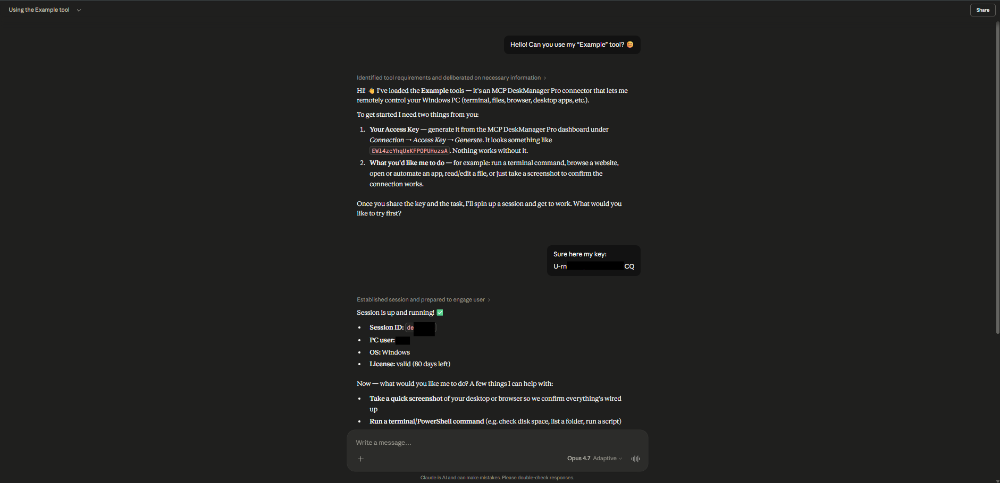
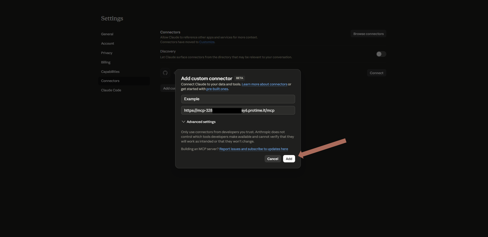

# MCP DeskManager

> Remote MCP server for Windows: control your PC from Claude or ChatGPT — terminal, files, your real browser and desktop apps, from any chat, phone included.

**MCP DeskManager** turns a Windows PC into a remote MCP (Model Context Protocol) server.
Install it on the machine you want to control, paste its private address into Claude or ChatGPT
as a custom connector, and every chat — web, desktop or phone — can operate that computer.
No port forwarding, no fixed IP, no config files to edit.

👉 **[Product page, guides and download → protime.it](https://protime.it/en/deskmanager/)**

---

## How it works

1. **Install** the setup on the PC you want to control (Windows 10/11, about 10 minutes).
2. The installer opens an **encrypted Cloudflare tunnel** with HTTPS and authentication, and gives you a private address.
3. **Paste the address** into Claude (Settings → Connectors → Add custom connector) or ChatGPT (developer mode → connectors). Done.

Unlike screenshot-driven computer use, DeskManager exposes **structured tools**: the assistant calls functions and reads real output instead of guessing pixels. Desktop programs are driven through Windows UI Automation.

---

## The 13 tools

| Tool | What the assistant can do |
|---|---|
| `terminal_executor` | Run PowerShell / CMD / WSL commands, background jobs, services |
| `terminal_reader` | Read the output of running or finished commands, follow long jobs |
| `file_reader` | Read any format: text, code, PDF, DOCX, XLSX, images, SQLite |
| `file_writer` | Write, edit, copy, move, download — with automatic versioning |
| `browser_action` | Drive a dedicated headless Chrome **or** your real logged-in Chrome |
| `browser_reader` | Read pages, list interactive elements, full-page screenshots |
| `software_action` | Launch and control desktop apps via Windows UI Automation |
| `software_reader` | Inspect windows, UI elements, installed programs, monitors |
| `email_reader` | IMAP: inbox, search, threads, folders |
| `email_writer` | SMTP: send, reply, forward, attachments |
| `telegram` | Push notifications, keyword watchers on long jobs, scheduled pings |
| `system` | Sessions, CPU/RAM/GPU monitoring, desktop screenshots, file delivery |
| `help` | Built-in reference for every tool |

**Your own Chrome.** With the free [Browser Bridge extension](https://chromewebstore.google.com/detail/mcp-deskmanager-browser-b/fmfdkjnbmfboljohnimcdoicgffdbapp) the assistant can use the Chrome you already use, with your logins, in a tab of its own — and it asks before using it.

**Persistent sessions.** Terminal tabs survive between messages and keep their working directory and environment.

---

## Security and data

- **Runs where you decide** — your desktop, an office workstation or your own Windows VPS. The product *is* the server: it lives on your machine, not ours.
- **Private address** published nowhere, behind **OAuth** or an access key.
- **Encrypted tunnel**: nothing is exposed on your router — no open ports, no inbound firewall rules.
- **One key per assistant**, each with its own switch: disconnect ChatGPT without touching Claude.
- **Approval required** for irreversible operations; normal deletes go to the Recycle Bin; secrets typed into commands are masked.
- **We store one thing: your email address**, to deliver and validate the licence. Your files, command output and screenshots never transit our systems.

Details: [Privacy](https://protime.it/en/privacy/) · [Terms](https://protime.it/en/terms/)

---

## Requirements

- Windows 10 or 11 (64-bit)
- A Claude or ChatGPT account that allows custom MCP connectors
- About 10 minutes for setup

Current plans and prices: **[protime.it/en/deskmanager](https://protime.it/en/deskmanager/#pricing)**

---

## Guides

- [MCP server on Windows: every option compared](https://protime.it/en/deskmanager/blog/remote-mcp-server-windows-no-port-forwarding/)
- [Install MCP on Windows: 4 methods, easiest first](https://protime.it/en/deskmanager/blog/install-mcp-server-windows-easy/)
- [Control your PC with Claude: every way compared](https://protime.it/en/deskmanager/blog/control-windows-pc-from-claude-chat/)
- [Control your PC from your phone with AI](https://protime.it/en/deskmanager/blog/control-pc-from-phone-with-ai/)
- [Claude Desktop remote MCP: connectors vs extensions](https://protime.it/en/deskmanager/blog/claude-desktop-remote-mcp-server/)
- [ChatGPT MCP on Windows](https://protime.it/en/deskmanager/blog/chatgpt-mcp-windows/)
- [Documentation](https://protime.it/en/deskmanager/docs/) · [Download](https://protime.it/en/deskmanager/download/)
- For AI agents: [`llms.txt`](https://protime.it/llms.txt) · [`llms-full.txt`](https://protime.it/llms-full.txt)

## Support

Open an issue in this repository, or use the chat assistant on [protime.it](https://protime.it/en/deskmanager/).

---

## About

Built and maintained by **[Protime](https://protime.it/en/)**, an independent software studio in Italy.
This repository hosts documentation and issue tracking: MCP DeskManager is a commercial product and its source code is not distributed.
